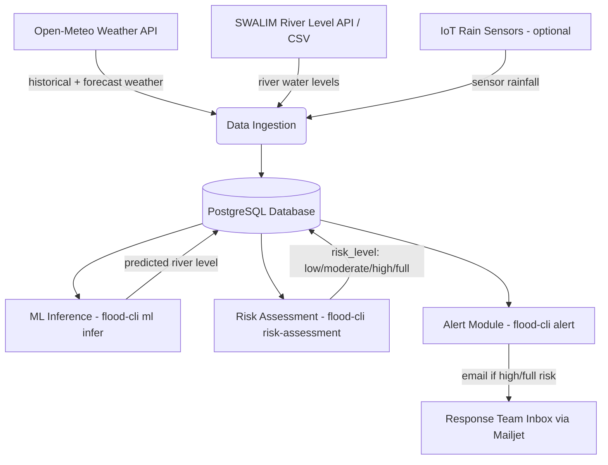

# Saadaal Flood Forecaster — Complete Guide

> **Who is this document for?** Everyone. If you are a program manager, a field officer, a new
> developer, or a system administrator, this single document explains **what the tool does, why
> it exists, and exactly how to operate every part of it** — from the command line to the
> automated daily pipeline to the emergency-recovery scripts.
>
> Technical jargon is explained the first time it appears. Look for the 💡 boxes for
> plain-language explanations.

---

## Table of Contents

1. [What is the Flood Forecaster?](#1-what-is-the-flood-forecaster)
2. [How it Works, End to End](#2-how-it-works-end-to-end)
3. [Key Concepts & Glossary](#3-key-concepts--glossary)
4. [Installing the Tool](#4-installing-the-tool)
5. [Configuration (`config/config.ini`)](#5-configuration-configconfigini)
6. [The Command-Line Tool (`flood-cli`)](#6-the-command-line-tool-flood-cli)
   - [6.1 `data-ingestion` — fetching weather & river data](#61-data-ingestion--fetching-weather--river-data)
   - [6.2 `database-model` — inspecting & managing the database](#62-database-model--inspecting--managing-the-database)
   - [6.3 `ml` — training & running the forecasting models](#63-ml--training--running-the-forecasting-models)
   - [6.4 `risk-assessment` — classifying flood risk](#64-risk-assessment--classifying-flood-risk)
   - [6.5 `alert` — sending flood-warning emails](#65-alert--sending-flood-warning-emails)
7. [The Daily Automated Pipeline (Production Scripts)](#7-the-daily-automated-pipeline-production-scripts)
8. [Maintenance & Troubleshooting Scripts](#8-maintenance--troubleshooting-scripts)
9. [The Database](#9-the-database)
10. [Sensor Integration (IoT Rain Gauges)](#10-sensor-integration-iot-rain-gauges)
11. [Email Alerts (Mailjet)](#11-email-alerts-mailjet)
12. [Monitoring & Error Tracking (Sentry)](#12-monitoring--error-tracking-sentry)
13. [Deployment (Docker / CapRover / Cron)](#13-deployment-docker--caprover--cron)
14. [Common Problems & How to Fix Them](#14-common-problems--how-to-fix-them)
15. [Quick-Reference Cheat Sheet](#15-quick-reference-cheat-sheet)
16. [Recent Changes](#16-recent-changes)

---

## 1. What is the Flood Forecaster?

The **Saadaal Flood Forecaster** is an early-warning system for river flooding in Somalia. It was
built for the **SAADAAL / Shaqodoon** program to protect communities living along rivers such as
the Shabelle and Juba by predicting dangerous water levels **before** they happen and sending
automatic email alerts to responders.

In plain language, the system does four things every day, automatically:

1. **Collects data** — it downloads the latest weather forecasts, historical weather, and river
   water-level readings for the monitored locations.
2. **Predicts the future** — it feeds that data into trained Machine Learning (ML) models that
   predict what the river level will be a number of days from now (e.g., 7 days ahead).
3. **Assesses risk** — it compares each prediction against known danger thresholds for that
   station (low / moderate / high / full flood risk).
4. **Sends alerts** — if a **high** or **full** flood risk is predicted, it emails a warning to
   the response team with a table of affected stations.

Everything above is driven by a single command-line program called **`flood-cli`**, plus a set of
support scripts used for automation and for fixing problems when they occur.

### Monitored river stations

The system currently ships trained models for these five stations:

- Belet Weyne
- Bulo Burti
- Jowhar
- Dollow
- Luuq

(Additional stations can be added once weather data and a trained model exist for them — see
[§6.3](#63-ml--training--running-the-forecasting-models).)

---

## 2. How it Works, End to End



**💡 In plain language:** Weather and river data flow into a shared database. A prediction engine
reads that data and estimates future river levels. Each prediction is labeled with a risk level.
If the risk is serious, an email goes out automatically.

This entire sequence is what runs once a day via the production automation script described in
[§7](#7-the-daily-automated-pipeline-production-scripts). Every step can also be run manually and
individually using the `flood-cli` tool, which is useful for testing, recovery, and one-off tasks.

---

## 3. Key Concepts & Glossary

| Term | Plain-language meaning |
|---|---|
| **CLI** (Command-Line Interface) | A program you control by typing text commands into a terminal window, instead of clicking buttons. Here it's called `flood-cli`. |
| **Station / Location** | A named point on a river (e.g., "Belet Weyne") where water level is measured and forecast. |
| **Historical weather** | Weather that has *already happened* — used to train and feed the models. |
| **Forecast weather** | Weather that is *predicted to happen* in the coming days — fetched from the Open-Meteo weather service. |
| **River level** | The height of water in the river, measured in meters. |
| **Forecast days** | How many days into the future a prediction is made for. `forecast_days=7` means "predict the level 7 days from now." A **different trained model is needed for each `forecast_days` value.** |
| **ML Model / Preprocessor** | A trained mathematical model (e.g., Prophet, XGBoost, RandomForest) that turns weather + river history into a predicted river level. Stored as files in the `models/` folder. |
| **Risk level** | A traffic-light-style classification of a predicted level: `low`, `moderate`, `high`, or `full` (most severe), based on thresholds specific to each station (e.g., "moderate flood risk," "bankfull"). |
| **Alert** | An automatic email sent when a `high` (or worse) risk level is detected in an upcoming prediction. |
| **Database (PostgreSQL)** | The central storage location for all weather data, river levels, predictions, and station information. Think of it as a very large, structured spreadsheet system. |
| **Schema** | A named grouping of tables inside the database (this project mainly uses the `flood_forecaster` schema and reads from a `public` schema owned by another app). |
| **Cron** | A built-in scheduler on Linux systems that runs a command automatically at a fixed time every day (here: daily at noon UTC). |
| **SWALIM** | FAO-SWALIM (Somalia Water and Land Information Management) — the external agency/API providing river-level data. |
| **Open-Meteo** | The external weather-data API/service used for historical and forecast weather. |
| **Sentry** | A third-party monitoring service that collects error logs from the running system so problems can be diagnosed remotely. |
| **Mailjet** | The email-sending service used to deliver flood alert emails. |

---

## 4. Installing the Tool

### Recommended: automated install script

```bash
git clone https://github.com/saadaal-dev/saadaal-flood-forecaster.git
cd saadaal-flood-forecaster
bash install.sh
```

`install.sh` will:

- Create an isolated Python environment in `.venv/`
- Install all required Python libraries
- Install the `flood-cli` command itself
- Set up script permissions and a `logs/` folder

Before running the tool, create a `.env` file in the project's root folder containing your
database password (this file is never committed to source control):

```txt
POSTGRES_PASSWORD="your-database-password"
```

### Manual installation (advanced users)

```bash
curl -LsSf https://astral.sh/uv/install.sh | sh
uv venv --python 3.12
source .venv/bin/activate
uv pip install -e .[dev]
uv pip install -e .
```

### Verifying the install

```bash
flood-cli --help
# or, without installing the console-script entry point:
python -m flood_forecaster_cli.main ml list-models
```

### Uninstalling

```bash
python -m pip uninstall flood-forecaster-tool
```

---

## 5. Configuration (`config/config.ini`)

Almost every command reads its settings from `config/config.ini` (you can point to a different
file with the global `-c/--configfile` option on every command). Key sections:

| Section | Purpose |
|---|---|
| `[data]` | Root data path (`data_path`) and whether data comes from `csv` or `database`. |
| `[data.static]` | Paths to static reference files: station mapping, station metadata, forecast locations. |
| `[data.csv]` | File paths used when working with local CSV files instead of the database. |
| `[data.database]` | Database name, user, and port (`POSTGRES_PASSWORD` itself comes from the environment/`.env`, never from this file). |
| `[openmeteo]` | Weather API URLs used for forecast/historical fetches. |
| `[river_data]` | SWALIM river-level API URL. |
| `[model]` | ML pipeline settings: how many days of weather/river history to look back (`weather_lag_days`, `river_station_lag_days`), how many days ahead to forecast (`forecast_days`), which model type to use (`model_type`), where trained models live (`model_path`), and where intermediate data is stored during training. |
| `[data.sensor]` | Controls whether IoT rain-gauge sensor readings are blended into forecasts (`use_sensor_rainfall`), and how sensor stations are matched to forecast locations (`sensor_max_distance_km`). |
| `[mailjet_config]` | Sender/receiver email identities used by the alert module. |

💡 **You will rarely need to edit this file** unless you are: adding a new station, changing which
ML model is used by default, or enabling the sensor-data feature.

---

## 6. The Command-Line Tool (`flood-cli`)

Every `flood-cli` command accepts a global option:

```
-c, --configfile PATH   Path to the configuration file (default: ./config/config.ini)
```

The tool is organized into 5 command **groups**, each covering one part of the pipeline:

```
flood-cli
├── data-ingestion       # fetch weather & river data from external sources
├── database-model       # inspect / export / validate the database
├── ml                    # preprocess, train, evaluate, and run forecasting models
├── risk-assessment       # classify predictions into low/moderate/high/full risk
└── alert                 # send email alerts for high-risk predictions
```

Run `flood-cli --help` or `flood-cli <group> --help` at any time to see the live list of commands
and options.

---

### 6.1 `data-ingestion` — fetching weather & river data

| Command | What it does |
|---|---|
| `fetch-openmeteo forecast\|historical` | Downloads weather data (forecast or historical) from the Open-Meteo API for all configured locations and stores it in the database. The `historical` variant also automatically removes accidental duplicate rows. Options: `-e/--empty-table` (wipe the table first), `--dry-run` (preview duplicate cleanup without deleting). |
| `fetch-river-data` | Downloads the latest river water-level readings from the SWALIM API and inserts any new readings into the database (existing readings are not duplicated). |
| `fetch-river-data-from-csv <location_name>` | Loads river levels from local CSV exports instead of the API — supports both **SNRFA** (`--snrfa-file`) and **SWALIM** (`--swalim-file`) export formats. Useful for one-time historical backfills. |
| `fetch-river-data-from-chart-api <location_name>` | Fetches river-level history for one station directly from SWALIM's chart API and saves it to a CSV file (`-o/--output` to choose the path). |
| `show-latest-swalim-river-csv <location_name>` | Prints the latest SWALIM river-level CSV for a station straight to the screen (no file saved) — handy for a quick manual check. |
| `show-latest-snrfa-river-csv <location_name>` | Same as above, but for the SNRFA archive source. |
| `load-csv` | *(Placeholder / not yet implemented)* Intended to load a generic CSV file into any database table. |
| `remove-duplicates-historical-weather` | Internal maintenance command that scans the historical weather table for duplicate (location, date) rows and removes them. `--dry-run` previews without deleting. |

**Example:**

```bash
flood-cli data-ingestion fetch-openmeteo forecast
flood-cli data-ingestion fetch-river-data
```

---

### 6.2 `database-model` — inspecting & managing the database

| Command | What it does |
|---|---|
| `list-db-schemas` | Lists every schema (named grouping of tables) available in the connected database. |
| `list-tables-from-schema -s <schema>` | Lists every table (and its columns/types) inside a given schema. |
| `fetch-table-to-csv -s <schema> -t <table> -d <path>` | Exports a database table to a CSV file on disk. Options: `--force-overwrite`, `--preview-rows N` (print the first N rows to the console), `--where "<SQL condition>"` (filter rows, e.g. `sensor_meaning LIKE '%Rainfall%'`). |
| `validate-sensor-readings` | Runs data-quality checks specifically on the `public.sensor_readings` table (the IoT rain-gauge data owned by the Shaqodoon mobile app). |
| `validate-table-data -s <schema> -t <table>` | Runs generic data-quality validation on any table and logs the issues found. |
| `compare-sensor-weather --location <label> --date-from <date> --date-to <date> [--output file.csv]` | Compares IoT sensor rainfall readings against Open-Meteo weather data for the same location/date range side by side, showing the difference (`delta_mm`). Useful for judging whether sensor data can be trusted as an input to the models. Can be repeated with multiple `--location` flags and optionally saved to CSV. |

**Example:**

```bash
flood-cli database-model list-tables-from-schema -s flood_forecaster
flood-cli database-model compare-sensor-weather -l bay__baydhaba --date-from 2025-01-01 --date-to 2025-01-31
```

---

### 6.3 `ml` — training & running the forecasting models

This group covers the full life cycle of a forecasting model: preparing data, training,
evaluating, and finally using the model to make predictions ("inference").

💡 **`forecast_days` matters a lot here**: it's *how many days ahead* a model predicts. A model
trained with `forecast_days=7` can only be used to predict 7 days ahead — a different trained
model file is required for each `forecast_days` value you want to support.

| Command | What it does |
|---|---|
| `preprocess <station> [config_path] [-f forecast_days]` | Prepares/cleans the raw data for one station so it is ready to feed into model training. |
| `analyze [config_path] [-f forecast_days]` | Produces analytical insights/statistics about the prepared data (useful for understanding data quality/trends before training). |
| `split <station> [config_path] [-f forecast_days]` | Splits the prepared data into a training set and a testing set (using the `train_test_date_split` date from the config). |
| `train <station> [config_path] [-f forecast_days] [-m model_type]` | Trains a new model for a station using the training data split. `model_type` can be any registered algorithm (e.g. `Prophet_001`, `XGBoost_001`, `RandomForestRegressor_001`). |
| `eval <station> [config_path] [-f forecast_days] [-m model_type]` | Evaluates an already-trained model against the held-out test data, reporting accuracy metrics. |
| `build-model <station> [config_path] [-f forecast_days] [-m model_type]` | Convenience command that runs **preprocess → analyze → split → train → eval** in one go — the full pipeline for building a new model. |
| `infer <station> [config_path] [-f forecast_days] [-d date] [-m model_type] [-o stdout\|database]` | **The command used in production.** Predicts the river level for a station on/after a given reference date. If `-d/--date` is omitted, "now" is used. `-o database` writes the prediction into the `predicted_river_level` table; `-o stdout` just prints it (useful for testing). |
| `bulk-infer <stations...> [-f forecast_days ...] [-m model_types ...] [-o stdout\|database]` | Runs `infer` for **every combination** of the given stations, forecast-day values, and model types in one call — a batch shortcut. Continues past individual failures and reports each error. |
| `list-model-types` | Prints every supported ML algorithm type known to the system (the "model registry"). |
| `list-stations` | Prints every station name defined in the configured station mapping file. |
| `list-models` | Prints every **pretrained** model file currently available in the `models/` folder, showing station, forecast-days, and model type for each. |

**Examples:**

```bash
# See what's available
flood-cli ml list-stations
flood-cli ml list-models

# Predict 7 days ahead for Belet Weyne using the Prophet model, and save to the database
flood-cli ml infer "Belet Weyne" -f 7 -m Prophet_001 -o database

# Train a brand-new model end-to-end for a station
flood-cli ml build-model "Jowhar" -f 7 -m XGBoost_001
```

---

### 6.4 `risk-assessment` — classifying flood risk

```bash
flood-cli risk-assessment
```

Takes no arguments. For every station, it reads the station's specific danger thresholds
(`moderate_threshold`, `high_threshold`, `full_threshold`, defined in the river station metadata)
and labels every not-yet-classified prediction in the `predicted_river_level` table with one of:

| Risk level | Meaning |
|---|---|
| `low` | Predicted level is below the station's moderate-flood threshold. Normal conditions. |
| `moderate` | Predicted level is at/above the moderate threshold but below the high threshold. Watch closely. |
| `high` | Predicted level is at/above the high threshold but below the "full" threshold. Significant flood danger — **this triggers alert emails.** |
| `full` | Predicted level is at/above the maximum ("full") threshold — the most severe category. **Also triggers alert emails.** |

This command is meant to be run right after new predictions are produced (it's the third step in
the daily pipeline).

---

### 6.5 `alert` — sending flood-warning emails

```bash
flood-cli alert
```

Takes no arguments. Checks the `predicted_river_level` table for any station with a `high` (or
worse) risk level in an upcoming prediction. If any are found, it builds a styled HTML email
(using `alert_template.html`) listing each affected station, its predicted water level, and the
predicted date, then sends it via **Mailjet** to the configured recipients (see
[§11](#11-email-alerts-mailjet)). If nothing meets the threshold, no email is sent.

---

## 7. The Daily Automated Pipeline (Production Scripts)

These shell scripts wire the individual `flood-cli` commands together into the full pipeline
described in [§2](#2-how-it-works-end-to-end), and are meant to be run automatically once a day
via `cron` (a Linux task scheduler) or inside the Docker container.

| Script | Purpose |
|---|---|
| `scripts/amadeus_saadaal_flood_forecaster.sh` | **Main production script.** Runs the full pipeline in sequence: fetch historical weather → fetch forecast weather → fetch river data → run inference for all 5 stations (7-day-ahead Prophet model) → risk assessment → alert. **Fails immediately** (`set -euo pipefail`) if any single step fails, so a broken step stops the whole run — this guarantees you never get a partial/inconsistent run silently. |
| `scripts/amadeus_saadaal_flood_forecaster_resilient.sh` | Same pipeline as above, but **keeps going even if a step fails**, logging colored success/failure/warning messages and printing a final summary of what worked and what didn't. Preferred for production environments with flaky networks, since one failed API call won't block the whole day's alerting. |
| `scripts/batch_infer_and_risk_assess.sh` | Runs inference + risk assessment for all configured stations without also re-fetching data or sending alerts — useful for manually re-running just the modeling step. |

**Usage (all three take the same arguments):**

```bash
./scripts/amadeus_saadaal_flood_forecaster.sh <REPOSITORY_ROOT_PATH> <VENV_PATH> [--windows]
```

**Example cron entry** (runs daily at noon):

```
0 12 * * * /root/Amadeus/saadaal-flood-forecaster/scripts/amadeus_saadaal_flood_forecaster.sh /root/Amadeus/saadaal-flood-forecaster /root/Amadeus/saadaal-flood-forecaster/.venv >> /root/Amadeus/saadaal-flood-forecaster/logs/logs_amadeus_saadaal_flood_forecaster.log 2>&1
```

💡 In the Docker-based deployment (see [§13](#13-deployment-docker--caprover--cron)), this
schedule is pre-configured in the `amadeus_saadaal_flood_forecaster_cron` file and runs
automatically inside the container — no manual cron setup is needed there.

### 7.1 Manually Triggering the Pipeline & Switching Cron Schedules

| Script | Purpose |
|---|---|
| `scripts/trigger_forecast_now.sh [--resilient]` | Runs the full pipeline immediately inside the container instead of waiting for the next cron tick — useful right after a deployment to confirm everything works end to end. Add `--resilient` to run the fault-tolerant variant instead of the strict one. |
| `scripts/switch_to_resilient_cron.sh` | Edits the container's live cron file (`/etc/cron.d/amadeus_saadaal_flood_forecaster_cron`) in place so it calls `amadeus_saadaal_flood_forecaster_resilient.sh` instead of the strict script, backs up the previous cron file first, and restarts the cron daemon to pick up the change. |
| `amadeus_saadaal_flood_forecaster_cron_frequent` | An alternate cron schedule (every 30 minutes instead of once daily) meant for quickly verifying a fresh deployment. Swap it in for the default cron file while testing, then switch back to the daily schedule once verified. |

---

## 8. Maintenance & Troubleshooting Scripts

These Python scripts are run manually (not scheduled) when something needs investigating or
fixing — for example, after the server was offline for a while, or when forecast data looks stale.

| Script | Purpose | When to use |
|---|---|---|
| `scripts/catchup_missing_predictions.py` | Interactively finds **every gap** in predictions (including gaps in the middle, not just at the end), lets you pick which stations and a start date, then re-fetches data and re-runs inference/risk-assessment for exactly the missing dates. | After the daily cron job failed for one or more days, or when onboarding a brand-new station with no prediction history yet. |
| `scripts/check_river_data_availability.py` | Reports, per station, the earliest/latest date with river-level data, flags stations with little or stale data, and recommends a safe start date for catch-up. | Before running the catch-up script, or whenever you get a "missing river level data" error. |
| `scripts/fill_river_data_gaps.py` | Fills gaps in the `historical_river_level` table by copying data from a separate `public.station_river_data` source table (matched via each station's SWALIM ID). Uses `ON CONFLICT DO NOTHING` so it never creates duplicates. | When the catch-up script fails because historical river-level data itself has holes. |
| `scripts/remove_duplicate_historical_weather.py [--dry-run]` | Finds duplicate `(location_name, date)` rows in `historical_weather` and deletes the older copies, keeping the most recent one. Must be run once before applying `sql/add_historical_weather_unique_constraint.sql` (see [§9](#9-the-database)), since that constraint will fail to create if duplicates still exist. | Before adding the unique constraint, or whenever duplicate weather rows are suspected. |
| `scripts/clear_cache.py` | Deletes the local HTTP cache files (`.cache*`) used by the weather API client, forcing the next fetch to get completely fresh data. | Forecast data looks outdated; least invasive fix — try this first. |
| `scripts/diagnose_forecast_data.py` | Prints statistics about the forecast weather table: total record count, overall date range, and per-location min/max dates and counts. | Investigating why forecasts seem missing, wrong, or out of date. |
| `scripts/force_refresh_forecast.py` | **⚠️ Destructive "nuclear option."** Deletes **all** forecast weather rows from the database, then re-fetches everything fresh from Open-Meteo. Requires typing `yes` to confirm. | Only after cache-clearing and re-ingestion have failed to fix persistently stale/corrupt forecast data. |

### Recommended recovery order after downtime

```bash
# 1. Understand what river data is available
python scripts/check_river_data_availability.py

# 2. Fill any gaps found
python scripts/fill_river_data_gaps.py

# 3. Make sure weather data is fresh
python scripts/clear_cache.py
flood-cli data-ingestion fetch-openmeteo historical
flood-cli data-ingestion fetch-openmeteo forecast
flood-cli data-ingestion fetch-river-data

# 4. Backfill any missing predictions
python scripts/catchup_missing_predictions.py

# 5. Let the normal daily cron job resume
```

### Typical "stale forecast data" troubleshooting order

```bash
python scripts/diagnose_forecast_data.py        # 1. See the scope of the problem
python scripts/clear_cache.py                    # 2. Try the gentle fix
flood-cli data-ingestion fetch-openmeteo forecast # 3. Re-fetch
python scripts/force_refresh_forecast.py         # 4. Nuclear option, only if still broken
```

Full narrative documentation with sample console output for each script is available in
[docs/SCRIPTS_REFERENCE.md](SCRIPTS_REFERENCE.md) and the quick command list in
[docs/SERVER_QUICK_REFERENCE.md](SERVER_QUICK_REFERENCE.md).

---

## 9. The Database

The system uses **PostgreSQL** as its single source of truth. Setup files live in `sql/`:

| File | Purpose |
|---|---|
| `sql/database_bootstrap.sql` | Creates the `flood_forecaster` schema and its 5 core tables. |
| `sql/database_indexes.sql` | Adds performance indexes (optional, recommended). |
| `sql/database_views.sql` | Defines convenience database views for common queries. |
| `sql/database_migration_predicted_river_level.sql` | Migration script for changes to the predictions table. |
| `sql/add_historical_weather_unique_constraint.sql` | Adds a `UNIQUE (location_name, date)` constraint to `historical_weather` so duplicate rows can no longer be inserted (ingestion already uses `ON CONFLICT DO UPDATE`). Run `scripts/remove_duplicate_historical_weather.py` first to clear any existing duplicates, or this migration will fail. |

### Core tables (`flood_forecaster` schema)

| Table | What it stores |
|---|---|
| `historical_weather` | Past daily weather (temperature, precipitation, rain, wind) per location — used to train and feed models. |
| `forecast_weather` | Predicted future weather per location — the main input to river-level inference. |
| `historical_river_level` | Past daily measured water levels (meters) per station. |
| `predicted_river_level` | The model's predicted water level for a station/date/forecast horizon, plus its `risk_level` once risk assessment has run. Has a uniqueness rule so the same station+date+model can't be double-inserted. |
| `river_station_metadata` | Static reference info per station: name, river, region, GPS coordinates, and the **danger thresholds** (`moderate_flood_risk_m`, `high_flood_risk_m`, `bankfull_m`) used by risk assessment. |

There is also a `public.sensor_readings` table, owned by a separate mobile app (Shaqodoon), which
this tool only **reads** from — see [§10](#10-sensor-integration-iot-rain-gauges).

A full entity diagram is available in
[docs/flood_forecaster_datamodel.md](flood_forecaster_datamodel.md).

### Setting up the database from scratch

```bash
psql -U postgres -d postgres -f sql/database_bootstrap.sql
psql -U postgres -d postgres -f sql/database_indexes.sql   # optional, recommended
```

---

## 10. Sensor Integration (IoT Rain Gauges)

In addition to weather-API data, the system can optionally incorporate **real, on-the-ground rain
sensor readings** collected by physical IoT devices (managed by the separate Shaqodoon mobile
app), stored in `public.sensor_readings`.

- This is **off by default** — enable it by setting `use_sensor_rainfall = True` under
  `[data.sensor]` in `config/config.ini`.
- Because sensor station IDs don't match the pipeline's location names directly, the system
  automatically matches each sensor to the *nearest* forecast location (within
  `sensor_max_distance_km`, default 50 km) using GPS coordinates.
- When enabled, sensor rainfall values take priority over Open-Meteo values for the same
  location/date during inference (sensor data is assumed to be more accurate/local).
- You can directly compare sensor readings against Open-Meteo weather data using:
  ```bash
  flood-cli database-model compare-sensor-weather -l <location> --date-from <date> --date-to <date>
  ```

Full technical details: [docs/sensor_readings_integration.md](sensor_readings_integration.md).

---

## 11. Email Alerts (Mailjet)

When `flood-cli alert` detects a `high` or `full` risk prediction, it sends an automatic email
via **Mailjet** (a third-party email delivery service) using a styled HTML template
(`alert_template.html`) containing a table of affected stations, predicted water levels, and
dates, plus safety guidance.

### One-time setup

1. Create a free account at [mailjet.com](https://www.mailjet.com/) and verify a sender email
   address.
2. Fill in `config/config.ini`:
   ```ini
   [mailjet_config]
   sender_email = your_verified_sender_email
   sender_name = Flood Alert
   receiver_email = recipient_email_or_contact_list
   receiver_name = Shaqodoon Team
   ```
3. Set the Mailjet API credentials as environment variables (never stored in config files):
   ```bash
   export MAILJET_API_KEY="your_mailjet_api_key"
   export MAILJET_API_SECRET="your_mailjet_api_secret"
   ```

### Manually testing alerts

```bash
flood-cli alert
```

💡 Make sure the database has up-to-date predictions (i.e., inference + risk-assessment already
ran) before testing, otherwise there will be nothing to alert on.

Full details: `src/flood_forecaster/alert_module/README.md`.

---

## 12. Monitoring & Error Tracking (Sentry)

The application integrates with **Sentry**, a hosted error-tracking service, so that problems in
production can be seen and diagnosed remotely without needing to SSH into the server and read raw
log files.

### What gets sent to Sentry

- Every log message at `ERROR` level or above (with full stack trace).
- Lower-severity messages (`INFO`, `WARNING`) are attached as "breadcrumbs" — a trail of recent
  events leading up to an error, for context.
- Manually captured exceptions/messages with extra structured context (e.g., which station and
  date were being processed when something failed).

### Setup

```bash
export SENTRY_DSN="https://your-dsn-here@sentry.io/project-id"
export SENTRY_ENVIRONMENT="production"    # or staging/development
export SENTRY_RELEASE="0.1.2"             # optional
export LOG_LEVEL="INFO"                   # or DEBUG for verbose logging
```

In a CapRover deployment, these are set under **App Configs → Environment Variables**.

Full details: [docs/SENTRY_INTEGRATION.md](SENTRY_INTEGRATION.md).

---

## 13. Deployment (Docker / CapRover / Cron)

The application is designed to run inside a **Docker container** on a server, managed through
**CapRover** (a self-hosted PaaS/deployment dashboard), with the daily pipeline triggered by
`cron` running *inside* the container.

### How the container starts (`docker-entrypoint.sh`)

1. Writes an explicit **allowlist** of the environment variables the application actually reads
   (`DB_HOST`, `POSTGRES_PASSWORD`, `SENTRY_DSN`, `SENTRY_ENVIRONMENT`, `SENTRY_RELEASE`,
   `LOG_LEVEL`, `MAILJET_API_KEY`, `MAILJET_API_SECRET`, `CONTACT_LIST_ID`) to a `.env` file
   created with `0600` permissions — so the cron job (which runs in a different shell context)
   can still see secrets like the database password, without persisting the *entire* container
   environment to disk in plaintext (an earlier version used `printenv > .env`, which leaked
   unrelated variables and left the file world-readable).
2. Ensures the log file/folder exists.
3. Starts the `cron` daemon (which reads its schedule from `amadeus_saadaal_flood_forecaster_cron`
   — by default, daily at **noon UTC**).
4. Tails (continuously prints) the log file, so `docker logs` shows live pipeline output.

### Deploying via CapRover UI

1. Open the CapRover dashboard → **Apps** tab → select the target app (e.g. `app-test`).
2. Go to the **Deployment** tab → **Method 3: Deploy from GitHub/Bitbucket/GitLab**.
3. Fill in:
   - Repository: `github.com/saadaal-dev/saadaal-flood-forecaster`
   - Branch: `main`
   - Username/Password: any value (the repository is public)
4. Click **Save & Restart**, then **Force Build** to trigger a deployment.
5. Check the **Logs** tab for the cron initialization message and pipeline output.

💡 To change *when* the pipeline runs, edit the schedule inside the
`amadeus_saadaal_flood_forecaster_cron` file (cron syntax) and redeploy.

Full details: [docs/container-deployment-guide.md](container-deployment-guide.md).

### Accessing a running server (operational quick reference)

```bash
ssh user@<server-ip>
docker exec -it <container-id> bash
cd /root/Amadeus/saadaal-flood-forecaster
source .venv/bin/activate
```

Full command list: [docs/SERVER_QUICK_REFERENCE.md](SERVER_QUICK_REFERENCE.md).

---

## 14. Common Problems & How to Fix Them

| Symptom | Likely cause | Fix |
|---|---|---|
| Forecast data looks old / stale | Cached HTTP responses from the weather API | `python scripts/clear_cache.py`, then re-run `flood-cli data-ingestion fetch-openmeteo forecast` |
| Predictions missing for one or more days | Cron job failed / server was down | `python scripts/catchup_missing_predictions.py` |
| Catch-up script errors with "Missing river level data" | Historical river-level data itself has gaps for that date range | Run `python scripts/check_river_data_availability.py` to find a safe date range, then `python scripts/fill_river_data_gaps.py` to backfill |
| A station is skipped during catch-up | No trained ML model exists for that station/forecast-days combination | Train one with `flood-cli ml build-model <station> -f <days> -m <model_type>`, or accept the station is unsupported for now |
| No alert emails are being sent | Risk assessment hasn't run yet, or predictions are all `low`/`moderate`, or Mailjet credentials are missing | Confirm `flood-cli risk-assessment` ran after inference; check `MAILJET_API_KEY`/`MAILJET_API_SECRET` are set |
| Forecast data still broken after clearing cache | Deeper data corruption or long outage | `python scripts/force_refresh_forecast.py` (⚠️ deletes and re-fetches ALL forecast data — confirm before running) |
| Duplicate rows in `historical_weather` | Ingestion inserted the same `(location_name, date)` twice before the DB-level unique constraint existed | `python scripts/remove_duplicate_historical_weather.py --dry-run` to preview, rerun without `--dry-run` to delete, then apply `sql/add_historical_weather_unique_constraint.sql` once to prevent recurrence |
| Need to know what's wrong right now | — | `python scripts/diagnose_forecast_data.py` for a data snapshot, or check Sentry / `logs/logs_amadeus_saadaal_flood_forecaster.log` |

---

## 15. Quick-Reference Cheat Sheet

```bash
# ---- Install ----
bash install.sh

# ---- Data ingestion ----
flood-cli data-ingestion fetch-openmeteo historical
flood-cli data-ingestion fetch-openmeteo forecast
flood-cli data-ingestion fetch-river-data

# ---- Database inspection ----
flood-cli database-model list-db-schemas
flood-cli database-model list-tables-from-schema -s flood_forecaster
flood-cli database-model fetch-table-to-csv -s flood_forecaster -t historical_river_level -d ./export.csv

# ---- Machine learning ----
flood-cli ml list-stations
flood-cli ml list-models
flood-cli ml list-model-types
flood-cli ml infer "Belet Weyne" -f 7 -m Prophet_001 -o database
flood-cli ml bulk-infer "Belet Weyne" "Jowhar" -f 7 -m Prophet_001 -o database
flood-cli ml build-model "Jowhar" -f 7 -m XGBoost_001

# ---- Risk & alerting ----
flood-cli risk-assessment
flood-cli alert

# ---- Full daily pipeline (manual run) ----
./scripts/amadeus_saadaal_flood_forecaster_resilient.sh $(pwd) $(pwd)/.venv

# ---- Recovery after downtime ----
python scripts/check_river_data_availability.py
python scripts/fill_river_data_gaps.py
python scripts/catchup_missing_predictions.py

# ---- Troubleshooting stale data ----
python scripts/diagnose_forecast_data.py
python scripts/clear_cache.py
python scripts/force_refresh_forecast.py   # destructive, last resort
```

---

## 16. Recent Changes

A round of PRs merged on 2026-09-23 touched several areas this guide describes. Highlights:

| Change | What it means for you |
|---|---|
| **Security fix — `.env` no longer dumps the whole container environment** | `docker-entrypoint.sh` now writes only an explicit allowlist of variables (`DB_HOST`, `POSTGRES_PASSWORD`, `SENTRY_DSN`, `SENTRY_ENVIRONMENT`, `SENTRY_RELEASE`, `LOG_LEVEL`, `MAILJET_API_KEY`, `MAILJET_API_SECRET`, `CONTACT_LIST_ID`) to `.env`, with `0600` permissions instead of world-readable defaults. See [§13](#13-deployment-docker--caprover--cron). |
| **Fix — `flood-cli alert` no longer crashes** (RISK-006) | The alert step previously raised `AttributeError: 'datetime.date' object has no attribute 'date'` whenever `predicted_river_level.date` returned rows, which meant alert emails silently never went out in production. This is now fixed and covered by a regression test. |
| **New: resilient forecast operations tooling** | `scripts/trigger_forecast_now.sh`, `scripts/switch_to_resilient_cron.sh`, and the `amadeus_saadaal_flood_forecaster_cron_frequent` test schedule make it easier to manually trigger and validate a fresh deployment. See [§7.1](#71-manually-triggering-the-pipeline--switching-cron-schedules). |
| **New: historical weather deduplication** | `scripts/remove_duplicate_historical_weather.py` plus `sql/add_historical_weather_unique_constraint.sql` clean up and then prevent duplicate `(location_name, date)` rows in `historical_weather`. See [§8](#8-maintenance--troubleshooting-scripts) and [§9](#9-the-database). |
| **New: on-demand CapRover deployment workflow** | `.github/workflows/deploy-caprover.yml` lets a maintainer trigger a CapRover build/deploy manually from the GitHub Actions tab (with retries and clear failure diagnostics), instead of only via the CapRover UI's "Force Build" button. |
| **Documentation reorganized** | Several docs were renamed/split into topic-specific files under `docs/` (see updated links below); `docs/improvement-backlog.md` now tracks open risks/issues (e.g. RISK-002, DATA-004) referenced from code comments and commit messages. |

---

### Related documents in this repository

- [docs/README.md](README.md) — index of all documentation, including the topic-specific `docs/components/*` guides.
- [scripts-reference.md](scripts-reference.md) — narrative reference with full sample output for every script.
- [server-quick-reference.md](server-quick-reference.md) — condensed server/CLI/SQL cheat sheet.
- [container-deployment-guide.md](container-deployment-guide.md) — CapRover deployment steps.
- [flood-forecaster-datamodel.md](flood-forecaster-datamodel.md) — database entity diagram.
- [sensor-readings-integration.md](sensor-readings-integration.md) — IoT sensor integration details.
- [sensors-quick-guide.md](sensors-quick-guide.md) — condensed quick-start for the sensor integration.
- [sentry-integration.md](sentry-integration.md) — error tracking and logging setup.
- [high-level-design.md](high-level-design.md) — architecture and design rationale.
- [improvement-backlog.md](improvement-backlog.md) — tracked risks, bugs, and planned improvements (e.g. RISK-002, RISK-006, DATA-004).
- [../README.md](../README.md) — repository structure, tests, and contribution guidelines.
