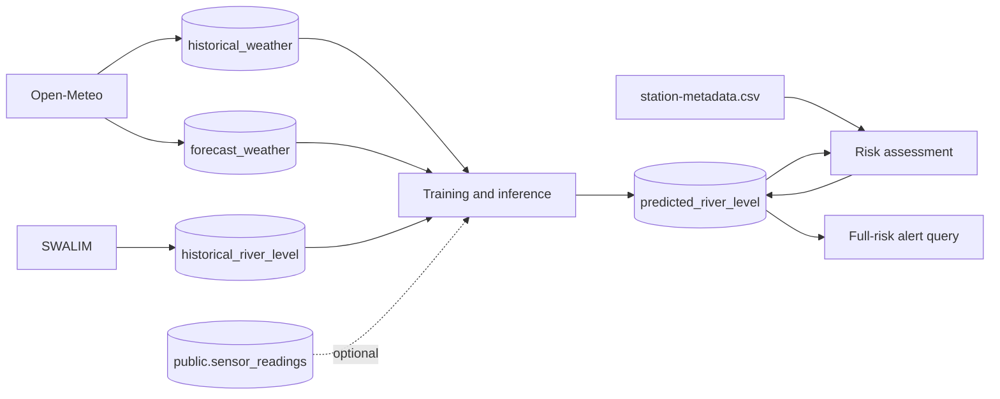

# Database and data model

## Responsibility

PostgreSQL is the integration point between ingestion, inference, risk assessment, and alerting. SQLAlchemy models map
runtime records; Pandera models validate selected data-frame boundaries.

## Connection and ownership

- Database name, user, and port come from `[data.database]` in `config/config.ini`.
- `DB_HOST` and `POSTGRES_PASSWORD` come from the environment or root `.env`.
- Application-owned tables use schema `flood_forecaster`.
- Optional `public.sensor_readings` is externally owned by the Shaqodoon application and is read-only to this project.

## Application tables

| Table                    | Producer                                            | Consumers                        | Important constraint / behavior                                                                            |
|--------------------------|-----------------------------------------------------|----------------------------------|------------------------------------------------------------------------------------------------------------|
| `historical_weather`     | Open-Meteo historical ingestion                     | Training and inference loaders   | Unique `(location_name, date)`; upserted                                                                   |
| `forecast_weather`       | Open-Meteo forecast ingestion                       | Inference loader                 | Unique `(location_name, date)`; upserted, old forecasts are retained                                       |
| `historical_river_level` | SWALIM latest data or CSV backfill                  | Training and inference loaders   | **DATA-005:** no SQL uniqueness; ingestion checks station/date before insert                               |
| `predicted_river_level`  | ML inference                                        | Risk assessment, alerting, views | Unique `(location_name, date, ml_model_name)`; **RISK-001:** prediction upsert does not clear `risk_level` |
| `river_station_metadata` | Bootstrap/static loading outside the daily pipeline | Optional views/reference queries | Unique `station_name`; **DATA-006:** daily risk logic currently uses the static CSV instead                |

The optional `public.sensor_readings` table is documented
in [Sensor readings integration](../sensor-readings-integration.md).

## Record lifecycle



No retention, partitioning, archival, or automatic backup policy is implemented in this repository.

## Prediction fields

| Field                      | Meaning                                                               |
|----------------------------|-----------------------------------------------------------------------|
| `location_name`            | Forecast station name                                                 |
| `date`                     | Inference **reference date**, not target date                         |
| `forecast_days`            | Horizon where `1` means the reference day                             |
| `ml_model_name`            | Artifact identity, e.g. `Preprocessor_001-f7-Prophet_001-Belet Weyne` |
| `level_m`                  | Predicted absolute river level                                        |
| `risk_level`               | Lowercase `low`, `moderate`, `high`, or `full`; initially null        |
| `created_at`, `updated_at` | Initial insert and most recent prediction upsert timestamps           |

Derive the model target date as:

```sql
SELECT date + (forecast_days - 1) AS target_date
FROM flood_forecaster.predicted_river_level;
```

## Bootstrap and optional objects

For a fresh database:

```bash
psql -U postgres -d postgres -f sql/database_bootstrap.sql
psql -U postgres -d postgres -f sql/database_indexes.sql
psql -U postgres -d postgres -f sql/database_views.sql
```

`docker-compose.yml` automatically mounts only `database_bootstrap.sql` into a fresh local PostgreSQL 15 container.
Apply indexes and views explicitly. The bootstrap contains plain `ADD CONSTRAINT` statements, so it is intended for a
fresh schema rather than repeated migration runs.

**DB-002:** `database_migration_predicted_river_level.sql` also installs a `BEFORE UPDATE` trigger that sets
`updated_at` to the database current timestamp. That trigger is **not** created by `database_bootstrap.sql`; the
inference upsert sets `updated_at` itself, but other updates only receive automatic timestamps when the migration has
been applied.

`database_indexes.sql` adds single-column indexes and common location/date composites. `database_views.sql` defines:

- `latest_predictions`: rows whose stored reference date is after the database current date, joined to metadata by
  `station_number`.
- `risk_summary`: aggregate counts for future stored reference dates.

**DB-001:** These views are not used by the Python pipeline. Current limitations make them unsuitable as authoritative
operational views without revision: inference does not populate `station_number`, `risk_summary` compares uppercase
labels while the application writes lowercase labels, and view date filters operate on stored reference dates rather
than derived target dates.

Priorities and completion criteria for these database gaps are maintained in
the [improvement backlog](../improvement-backlog.md).

## Common checks

```sql
-- Latest source data by location
SELECT location_name, MAX(date), COUNT(*)
FROM flood_forecaster.forecast_weather
GROUP BY location_name
ORDER BY MAX(date) DESC;

-- Predictions with derived target dates
SELECT location_name,
       date                       AS reference_date,
       date + (forecast_days - 1) AS target_date,
       level_m,
       risk_level,
       ml_model_name
FROM flood_forecaster.predicted_river_level
ORDER BY reference_date DESC, location_name;

-- Rows still awaiting risk classification
SELECT COUNT(*)
FROM flood_forecaster.predicted_river_level
WHERE risk_level IS NULL;
```

## Key implementation paths

- Bootstrap/migration objects: `sql/`
- ORM and Pandera models: `src/flood_forecaster/data_model/`
- Connection and inspection utilities: `src/flood_forecaster/utils/database_helper.py`
- Detailed field diagram: [Database diagram](../flood-forecaster-datamodel.md)
