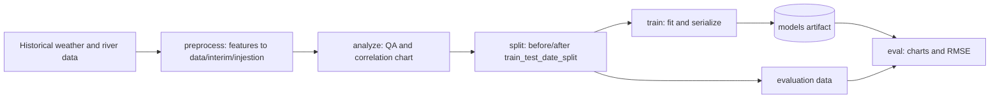

# ML pipeline

## Responsibility

The ML component prepares time-series features, trains/evaluates station- and horizon-specific models, loads serialized
artifacts for inference, and optionally stores predictions. Training is manual; the daily scheduled pipeline only
performs inference.

## Inputs and features

For a target station, `station-mapping.json` identifies its reference/upstream river stations and weather locations.
`preprocess_diff()` then creates:

- River-level lags for every configured upstream station.
- Precipitation sum/hour lags for every configured weather location.
- Forecast precipitation features for zero or negative weather offsets (`0` is the reference day, `-2` is two days after
  it).
- Circular month and day-of-year features.
- Training target `y`, the future absolute level minus the previous-day (`lag01`) level.

Current configured river offsets are `1, 3, 7, 14, 30`; weather offsets are `1, 3, 7, 14, 30, 0, -2, -6`. Rows missing
any required feature are dropped. Inference additionally verifies complete daily coverage for every required
river/weather location and fails rather than silently imputing gaps.

## Horizon semantics

`forecast_days = N` predicts the level at `reference date + N - 1`:

- `1` predicts the reference day.
- `7` predicts six calendar days after the reference day.

A different horizon requires a different trained artifact. The scheduled pipeline explicitly uses horizon `7`, even
though the configuration default is `1`.

## Development lifecycle



Typical full build:

```bash
flood-cli ml build-model "Belet Weyne" -f 7 -m Prophet_001
```

The configured split is `2023-10-01`. Evaluation reports RMSE, a previous-day baseline RMSE, threshold-weighted RMSE,
and writes plots under the evaluation path.

## Models and artifact identity

| Registry key                | Implementation                               | Notes                                               |
|-----------------------------|----------------------------------------------|-----------------------------------------------------|
| `Prophet_001`               | `ml_model/Prophet001/model.py`               | Explicit production choice in the scheduled scripts |
| `XGBoost_001`               | `ml_model/XGBoost001/model.py`               | Default in `config.ini` for commands that omit `-m` |
| `RandomForestRegressor_001` | `ml_model/RandomForestRegressor001/model.py` | Alternative tree model                              |

Artifacts are stored under `[model] model_path` and named:

```text
{preprocessor_type}-f{forecast_days}-{model_type}-{station}
```

Example: `Preprocessor_001-f7-Prophet_001-Belet Weyne`. The registry in `ml_model/registry.py` supplies each model's
train, serialize/load, evaluate, and infer callables.

## Scheduled inference

For each of five production stations, the resilient script runs:

```bash
flood-cli ml infer -f 7 -m Prophet_001 -o database "<station>"
```

Inference loads required river/weather windows, optionally overlays sensor rainfall, builds features with the same
preprocessor, loads the matching artifact, predicts a level difference, adds it to the previous-day level, and upserts
the absolute prediction.

The unique database identity is `(location_name, reference date, model name)`. The target date is not directly stored;
derive it from `date + forecast_days - 1`.

## Adding a model type

1. Add a package under `src/flood_forecaster/ml_model/` with compatible `train`, `train_and_serialize`, `load`, and
   `infer` functions.
2. Register a `ModelManager` in `registry.py`; add any model-specific evaluation adapter there.
3. Add unit tests for train/load/infer compatibility and artifact naming.
4. Build and evaluate artifacts for every station/horizon that will use the model.
5. Change scheduling only after the matching artifacts exist in `models/`.

## Key implementation paths

- Orchestration/API: `src/flood_forecaster/ml_model/api.py`
- Features: `src/flood_forecaster/ml_model/preprocess.py`
- Inference persistence: `src/flood_forecaster/ml_model/inference.py`
- Registry: `src/flood_forecaster/ml_model/registry.py`
- Artifacts: `models/`
