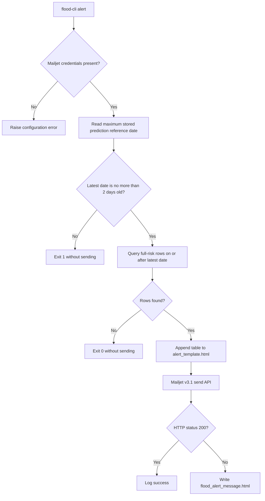

# Risk assessment and alerts

## Responsibility

Risk assessment converts predicted river levels into threshold labels. Alerting queries those labels, renders an HTML
table, and sends it through Mailjet. These are deterministic post-processing stages; they do not run an ML model.

## Risk classification

Thresholds come from `data/static/station-metadata.csv`, not `river_station_metadata` in PostgreSQL.

| Condition for predicted `level_m` | Stored label |
|-----------------------------------|--------------|
| `< moderate`                      | `low`        |
| `>= moderate` and `< high`        | `moderate`   |
| `>= high` and `< full`            | `high`       |
| `>= full`                         | `full`       |

The command iterates every static station and updates matching `predicted_river_level` rows only where
`risk_level IS NULL`.

```bash
flood-cli risk-assessment
```

### Important update behavior

Prediction upserts update `level_m`, `forecast_days`, and `updated_at`, but do not clear `risk_level`. Risk assessment
also refuses to overwrite a non-null label. Therefore, rerunning inference for an existing `(location, date, model)` can
leave a stale risk label if the predicted level changes. Reset affected labels to null before reassessment when
recomputing predictions.

## Alert decision flow



Only `full` risk triggers email. `moderate` and `high` predictions are stored but not emailed by the current
implementation.

The email sender/recipient and display names come from `[mailjet_config]`; API credentials come from `MAILJET_API_KEY`
and `MAILJET_API_SECRET`. The rendered table includes station, risk, predicted water level, and the stored prediction
date.

```bash
flood-cli alert
```

Running this command against production data may send a real notification.

## Date caveat

The prediction table stores the inference reference date. A horizon-seven target is six days later, but the alert
formatter currently displays the stored reference date as `Prediction date`; it calculates a target date and then
overwrites it. Until corrected, recipients should interpret that column as the model run/reference date.

## Threshold maintenance

When changing station thresholds:

1. Update `data/static/station-metadata.csv`.
2. Rebuild/evaluate models if the change affects evaluation interpretation.
3. Decide whether existing predictions must be reassessed; if so, clear their `risk_level` first.
4. Keep `river_station_metadata` synchronized if database views or external consumers use it.

## Key implementation paths

- Classifier: `src/flood_forecaster/risk_assessment/risk_assessment.py`
- Alert selection: `src/flood_forecaster/alert_module/flood_status.py`
- Email rendering/sending: `src/flood_forecaster/alert_module/alert.py`
- Template: `src/flood_forecaster/alert_module/alert_template.html`
