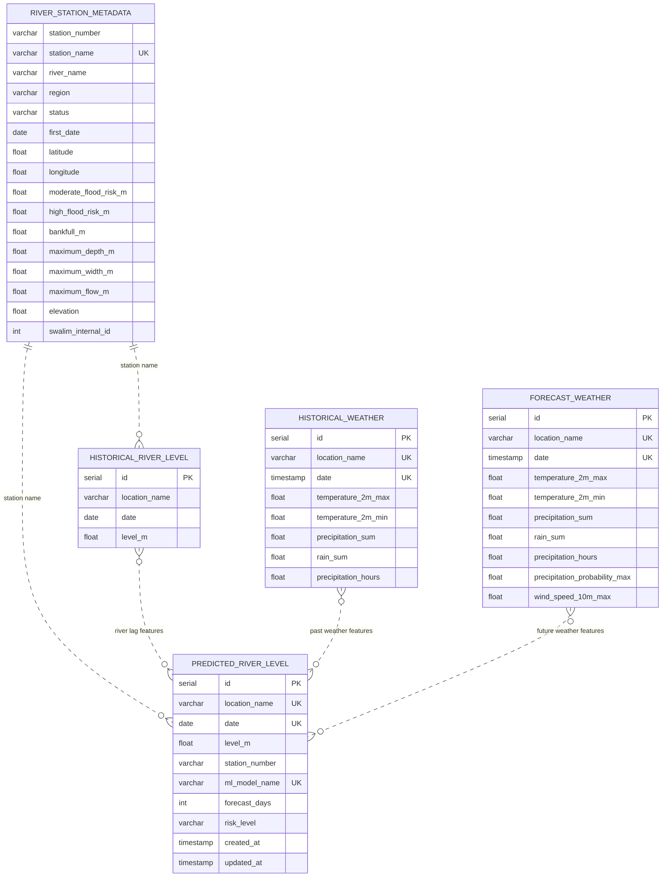

# Flood forecaster data model

The application owns five tables in PostgreSQL schema `flood_forecaster`. **DB-003:** relationships below are conceptual
joins; `sql/database_bootstrap.sql` defines uniqueness constraints but no foreign keys.

## Constraints and semantics

- `historical_weather`: unique `(location_name, date)`.
- `forecast_weather`: unique `(location_name, date)`.
- `predicted_river_level`: unique `(location_name, date, ml_model_name)`.
- `river_station_metadata`: unique `station_name`.
- **DATA-005:** `historical_river_level` has no uniqueness constraint; ingestion prevents duplicates in application
  code.
- **RISK-002:** `predicted_river_level.date` is the inference reference date. The target date is
  `date + forecast_days - 1`.
- Risk labels are lowercase `low`, `moderate`, `high`, or `full`.
- Optional IoT data is externally owned in `public.sensor_readings`, not this schema.

See [Database and data model](components/database.md) for lifecycle, ownership, views, and setup commands.
Implementation plans and completion criteria are maintained in the [improvement backlog](improvement-backlog.md).
