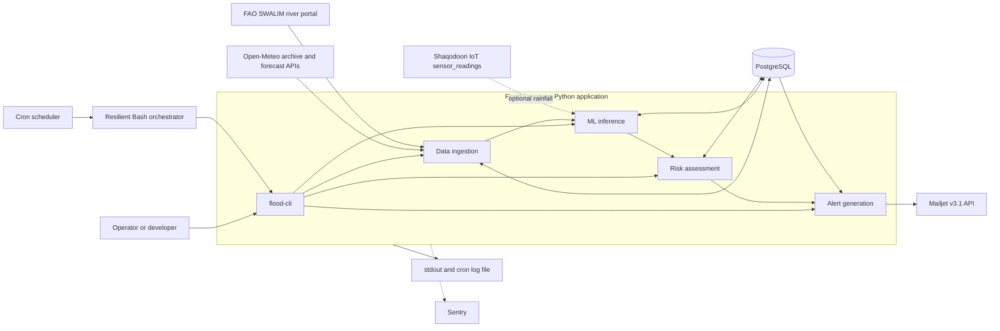
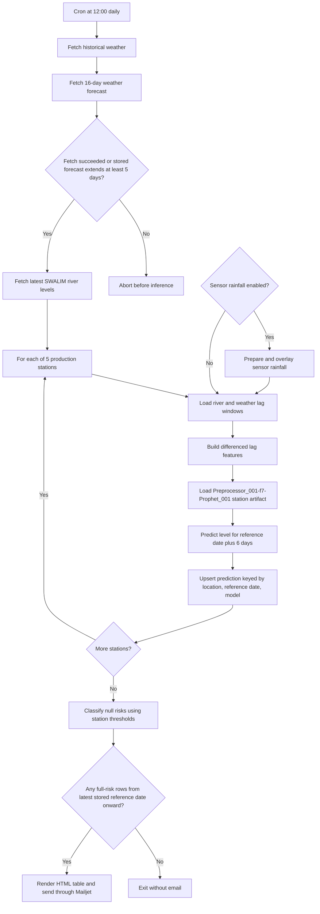
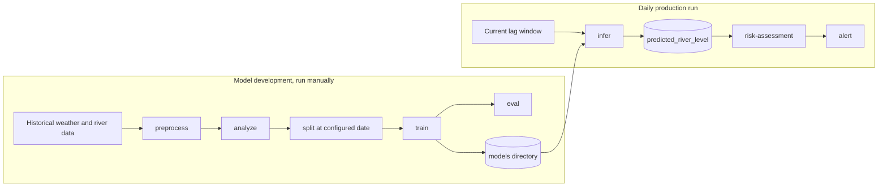
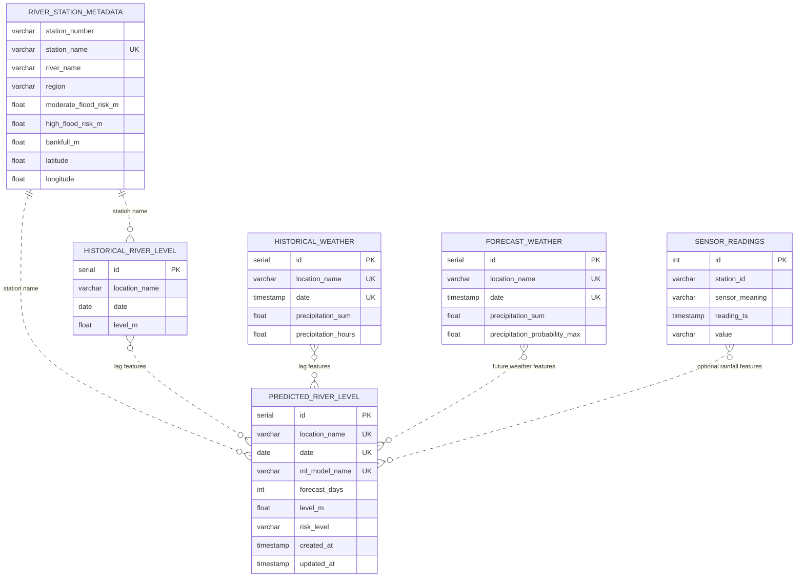
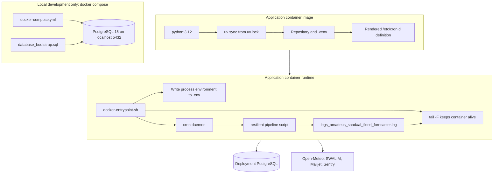

# High-level design

## Purpose and scope

Saadaal Flood Forecaster is a scheduled Python batch system. It collects weather and river observations, predicts river
levels for five configured stations, assigns threshold-based risk, and emails an alert when a prediction reaches `full`
risk.

The deployed process is not a web service and exposes no HTTP endpoint. Operators use the `flood-cli` command, Bash
scripts, database queries, container logs, and Sentry.

## System context

### External systems

| System              | Direction          | Interface                                                                                                        | Authentication / resilience                                                                   |
|---------------------|--------------------|------------------------------------------------------------------------------------------------------------------|-----------------------------------------------------------------------------------------------|
| Open-Meteo forecast | Inbound            | HTTPS, `api.open-meteo.com/v1/forecast`                                                                          | No API key; one-hour local request cache; five retries with backoff                           |
| Open-Meteo archive  | Inbound            | HTTPS, `archive-api.open-meteo.com/v1/archive`                                                                   | Same client behavior as forecast                                                              |
| FAO SWALIM          | Inbound            | HTTPS HTML table at `frrims.faoswalim.org/rivers/levels`; chart history also uses a form POST to `/rivers/graph` | No credentials; production wrapper retries the CLI command up to three times                  |
| PostgreSQL          | Read/write         | SQLAlchemy using PostgreSQL on configured host/port                                                              | `DB_HOST` and `POSTGRES_PASSWORD`; database/user/port come from `config.ini`                  |
| Shaqodoon sensors   | Inbound, optional  | Read-only `public.sensor_readings` in the same PostgreSQL connection                                             | Enabled by `[data.sensor] use_sensor_rainfall`; disabled by default                           |
| Mailjet             | Outbound           | Mailjet REST API v3.1                                                                                            | `MAILJET_API_KEY` and `MAILJET_API_SECRET`; failed delivery writes `flood_alert_message.html` |
| Sentry              | Outbound, optional | Sentry Python SDK                                                                                                | Enabled when `SENTRY_DSN` is present; errors become events and info logs become breadcrumbs   |

> The Open-Meteo and SWALIM calls currently use disabled TLS certificate verification. Treat the network path as trusted
> or change the implementation before using it across an untrusted boundary.

## Runtime data pipeline

The tracked cron starts the resilient script daily at `12:00` in the container's timezone. The `python:3.12` base image
does not set `TZ`, so this is normally UTC unless the deployment overrides the timezone.

Production stations are `Belet Weyne`, `Bulo Burti`, `Jowhar`, `Dollow`, and `Luuq`. Their upstream river stations and
weather locations are defined in `data/static/station-mapping.json`; risk thresholds are defined in
`data/static/station-metadata.csv`.

### Scheduled versus development pipeline

## Data design

PostgreSQL database `postgres` contains application-owned objects in schema `flood_forecaster`. Optional sensor data
remains owned externally in schema `public`. The links below are logical joins by names or station codes; the bootstrap
SQL defines no foreign keys.

See [Database and data model](components/database.md) for ownership, constraints, views, and lifecycle.

### Prediction date semantics

For `forecast_days = N`, inference predicts the level at `reference date + N - 1`. The current persistence code stores
the **reference date** in `predicted_river_level.date`, not the target date. It also stores `forecast_days`, allowing
consumers to derive the target date. Existing alert display code labels the stored reference date as `Prediction date`;
consumers should not assume it is the target date.

## Deployment design

The compose file does **not** run the application and only mounts `database_bootstrap.sql`; indexes and views must be
applied separately. Container deployment may use CapRover, but the image itself is platform-independent and expects an
externally reachable PostgreSQL server.

## Reliability and failure behavior

- Historical weather and river ingestion are retried three times; failure degrades to existing data.
- Forecast ingestion is retried and then checked for at least five days of future coverage. The pipeline aborts if that
  check fails.
- Inference failures are isolated per station; later stations still run.
- Risk assessment and alert failures are reported but do not undo earlier writes.
- A partially successful resilient run exits with status `2`; complete success is `0`, and total/critical failure is
  `1`.
- Weather and prediction writes are upserts. River ingestion checks for an existing station/date before insert.
- No retention or archival policy is implemented in this repository.

## Known design constraints

Implementation plans and status are tracked in the [improvement backlog](improvement-backlog.md).

1. **ML-001:** Production station/model choices are hard-coded in the Bash scripts rather than configuration.
2. **RISK-001:** `risk-assessment` only classifies rows whose `risk_level` is null; an updated prediction keeps its
   prior risk unless the field is reset.
3. **RISK-003:** The alert step only selects `full` risk and exits if the newest stored prediction date is more than two
   days old.
4. **DATA-006:** Static CSV station thresholds drive risk assessment even though a database metadata table also exists.
5. **DB-001:** The SQL views are optional and are not installed by Docker Compose. `risk_summary` checks uppercase risk
   labels while the application writes lowercase labels, so its counts need correction before operational use.
6. **SEC-002:** Secrets are passed through environment variables; the container entrypoint copies the complete
   environment into `.env`. Protect container filesystem access and avoid putting unrelated secrets in that environment.
7. **SENS-001 / SENS-002:** The current IoT sensor mappings do not overlap any weather location used by the five
   scheduled production stations. Sensor gap filling can also forward-fill or zero-fill missing observations before
   overlay, so review the [field sensor data integration](sensor-readings-integration.md) guide before enabling it.
