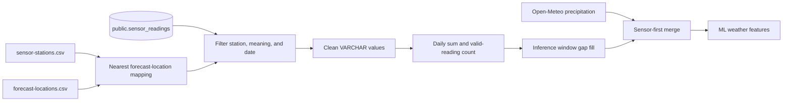

# Field sensor data integration

This is the technical reference for Shaqodoon IoT field-sensor data: where sensors are located, how their identifiers
map to forecast locations, how readings are cleaned and aggregated, and how optional rainfall values enter inference.
For a short non-technical summary, see [Field sensors: quick guide](sensors-quick-guide.md).

The behavior described here was checked against the implementation and static data on 2026-09-22.

## Current status

- The flood forecaster treats `public.sensor_readings` as an externally owned, read-only source.
- Only readings whose `sensor_meaning` contains the configured rainfall keyword are loaded. Water-level sensor readings
  are not used by this integration.
- Sensor rainfall is disabled by default: `[data.sensor] use_sensor_rainfall = False`.
- The inventory contains four sensor/type rows at three physical sites.
- **None of the three mapped forecast locations is used by the five currently scheduled production stations.** Enabling
  the flag without changing the sensor inventory or `station-mapping.json` therefore does not add sensor data to those
  scheduled inferences.
- Current gap filling can forward-fill a prior sensor rainfall total, or insert zero for leading/missing locations,
  before the sensor frame is merged over Open-Meteo. Review [limitations](#known-limitations-and-risks) before enabling
  this feature in production.

## Terminology and data sources

| Concept                     | Authoritative source                                           | Purpose                                                            |
|-----------------------------|----------------------------------------------------------------|--------------------------------------------------------------------|
| IoT field sensor            | `public.sensor_readings`                                       | Timestamped telemetry written by the Shaqodoon application         |
| Sensor inventory            | `data/static/sensor-stations.csv`                              | Human name, device label, coordinates, and descriptive sensor type |
| Forecast location           | `data/static/forecast-locations.csv`                           | Coordinate-labelled location used by weather features              |
| Production forecast station | `data/static/station-mapping.json`                             | River station with upstream river and weather-feature locations    |
| SWALIM river gauge          | `data/static/river_stations_metadata.csv` and SWALIM ingestion | River-level input; separate from the IoT sensor integration        |

IoT sensors, SWALIM river gauges, and production forecast stations are not interchangeable. IoT rainfall can only
augment a weather location after geographic mapping; it does not replace the SWALIM river-level input.

## Current sensor inventory and computed mappings

`data/static/sensor-stations.csv` currently contains:

| Site    | Device label (`station_id`) |  Latitude |  Longitude | Declared type      |
|---------|-----------------------------|----------:|-----------:|--------------------|
| Baidoa  | `BAIDOA_MOH`                | 3.1108195 | 43.6233185 | Weather station    |
| Afgooye | `MOHADM_AFG`                | 2.1409760 | 45.1085611 | Weather station    |
| Elbarde | `MOH_EBW1`                  | 4.6949753 | 43.5732575 | Water-level sensor |
| Baidoa  | `BAIDOA_MOH`                | 3.1108195 | 43.6233185 | Water-level sensor |

The mapping function deduplicates rows by device `label`, so the two Baidoa rows become one mapping entry. The `type`
column is descriptive and does not control which database readings are loaded; `sensor_meaning` in the database does.

Using the current forecast-location coordinates and the production haversine implementation gives:

| Site    | Device label | Nearest forecast location | Distance | Within 50 km? |
|---------|--------------|---------------------------|---------:|---------------|
| Baidoa  | `BAIDOA_MOH` | `bay__baydhaba`           |  17.4 km | Yes           |
| Afgooye | `MOHADM_AFG` | `lower_shabelle__afgooye` |  16.3 km | Yes           |
| Elbarde | `MOH_EBW1`   | `bakool__ceel_barde`      |  36.6 km | Yes           |

These distances are derived values, not manually configured relationships. They will change if either CSV's coordinates
change.

### Production coverage

The five production stations are Belet Weyne, Bulo Burti, Jowhar, Dollow, and Luuq. Their configured weather locations
currently have no intersection with:

```text
bakool__ceel_barde
bay__baydhaba
lower_shabelle__afgooye
```

Consequently, if the sensor flag is enabled, each current scheduled inference logs that no nearby sensor station was
found for its requested weather-location set and continues with Open-Meteo.

## Data flow



## Source table and models

The ORM model `SensorReading` maps `public.sensor_readings`. The implementation expects:

| Column                           | ORM type             | Use                                                                  |
|----------------------------------|----------------------|----------------------------------------------------------------------|
| `id`                             | integer, primary key | Row identity                                                         |
| `station_id`                     | string               | Usually matches the inventory's device `label`, such as `BAIDOA_MOH` |
| `sensor_id`                      | string               | Sensor/channel identifier on the device                              |
| `sensor_meaning`                 | string               | Selects rainfall rows using a case-insensitive substring match       |
| `reading_ts`                     | datetime             | Query and daily-aggregation timestamp                                |
| `value`                          | string               | Raw measurement or sentinel value                                    |
| `original_date`, `original_time` | string               | Device-provided values; not used for grouping                        |
| `firmware`                       | string               | Firmware metadata                                                    |
| `ingested_at`                    | datetime             | Source ingestion timestamp                                           |

The application does not create this table in `database_bootstrap.sql` and does not insert, update, or delete its rows.
Database permissions should enforce the intended read-only boundary.

`SensorReadingDataFrameSchema` validates raw query results while allowing extra columns. `SensorRainfallDataFrameSchema`
strictly validates the normalized output columns:

```text
location, date, precipitation_sum, precipitation_hours
```

## Configuration

The active defaults are in `config/config.ini`:

```ini
[data.sensor]
use_sensor_rainfall = False
rainfall_sensor_meaning = Rainfall
sensor_stations_file = ${data:data_path}/static/sensor-stations.csv
sensor_max_distance_km = 50
```

| Setting                   | Meaning                                                                  |
|---------------------------|--------------------------------------------------------------------------|
| `use_sensor_rainfall`     | Enables the inference-time sensor branch; does not change ingestion jobs |
| `rainfall_sensor_meaning` | Case-insensitive substring used in `sensor_meaning ILIKE '%…%'`          |
| `sensor_stations_file`    | Sensor inventory and coordinates                                         |
| `sensor_max_distance_km`  | Excludes a sensor when its nearest forecast location is farther away     |

Database access also requires `DB_HOST` and `POSTGRES_PASSWORD`.

## Geographic mapping

`build_sensor_location_mapping()` in `src/flood_forecaster/utils/geo.py`:

1. Loads the sensor and forecast-location CSV files.
2. Keeps the first row for each unique sensor `label`.
3. Calculates great-circle distance from that sensor to every forecast location.
4. Selects the nearest location.
5. Excludes the sensor and logs a warning if the distance exceeds `sensor_max_distance_km`.
6. Adds aliases for both the device label (`BAIDOA_MOH`) and human name (`Baidoa`).

Nearest geographic distance does not prove hydrological or meteorological representativeness. Review proposed mappings
before using them as model inputs.

## Loading, cleaning, and daily aggregation

`load_sensor_rainfall_db()` performs these steps:

1. Builds the geographic mapping and keeps only sensors mapped to requested locations.
2. Queries the inclusive date window from `00:00:00` through `23:59:59`.
3. Filters `sensor_meaning` with the configured case-insensitive rainfall substring.
4. Cleans the raw `value` string.
5. Interprets `reading_ts` as UTC, derives its UTC calendar date, and maps `station_id` to a forecast location.
6. Groups by `(location, date)`, summing valid values and counting valid rows.

### Value cleaning

| Raw value                                          | Current behavior                                                          |
|----------------------------------------------------|---------------------------------------------------------------------------|
| `---`, empty string, `NULL` in any case            | Discarded                                                                 |
| `-999.99`                                          | Discarded                                                                 |
| `0`, `0.0`                                         | Discarded as configured sentinel values                                   |
| Other non-numeric string                           | Discarded by numeric coercion                                             |
| Numeric value below `-100`                         | Discarded as an error code                                                |
| Numeric value from `-100` through a negative value | Not explicitly discarded; a negative aggregate can fail schema validation |
| Positive numeric value                             | Included in the daily sum                                                 |

Treating zero as invalid means a recorded dry-hour zero does not count toward coverage. Confirm that this matches device
semantics before relying on daily totals.

`precipitation_hours` is the number of valid rows in the day. It is only an actual hour count if devices report exactly
once per hour without duplicates.

### Time handling

The loader parses `reading_ts` with `utc=True` and groups on its UTC date. It does not use or reconcile `original_date`
and `original_time`. If source timestamps represent local time without a correct timezone, readings around midnight can
be assigned to an unexpected day.

## Inference behavior

When sensor rainfall is enabled, `infer()` first loads normal Open-Meteo weather and then requests sensor data for the
same configured weather locations.

`load_inference_sensor_rainfall()` uses the configured weather-lag window and caps sensor access at yesterday because
sensors provide no forecast. With the current lag defaults and an inference run for today, it requests sensor data from
30 days ago through yesterday.

Behavior then depends on the result:

- If no relevant sensor rows exist at all, the sensor frame remains empty and Open-Meteo is unchanged.
- If any sensor rows exist, missing dates for each requested location are inserted. Internal gaps are forward-filled
  from the previous sensor day; leading gaps and locations with no sensor rows are filled with zero.
- The sensor frame is left-merged onto Open-Meteo by `(location, date)`.
- Sensor `precipitation_sum` and `precipitation_hours` take precedence wherever they are non-null.
- Open-Meteo remains in use for rows outside the sensor frame, including future weather dates.

No confidence weighting or blending is performed. Temperature, wind, and other weather fields are not supplied by this
sensor path.

## Inspecting and comparing data

These commands read the database but do not modify sensor rows:

```bash
# General source-table quality checks
flood-cli database-model validate-sensor-readings

# Compare one mapped location with Open-Meteo over an inclusive date range
flood-cli database-model compare-sensor-weather \
  --location bay__baydhaba \
  --date-from 2026-09-01 \
  --date-to 2026-09-21

# Human site names and device labels are accepted as aliases
flood-cli database-model compare-sensor-weather \
  --location Baidoa \
  --location MOHADM_AFG \
  --date-from 2026-09-01 \
  --date-to 2026-09-21 \
  --output sensor-weather-comparison.csv
```

The terminal table shows sensor precipitation, Open-Meteo precipitation, and their difference. The optional CSV
additionally retains sensor/Open-Meteo reading-count columns. `--location` is repeatable.

Useful read-only SQL checks include:

```sql
-- Inventory of meanings and devices represented in the source table
SELECT station_id, sensor_meaning, COUNT(*) AS readings
FROM public.sensor_readings
GROUP BY station_id, sensor_meaning
ORDER BY station_id, sensor_meaning;

-- Freshness by station and meaning
SELECT station_id, sensor_meaning,
       MIN(reading_ts) AS first_reading,
       MAX(reading_ts) AS latest_reading,
       COUNT(*) AS readings
FROM public.sensor_readings
GROUP BY station_id, sensor_meaning
ORDER BY latest_reading DESC;

-- Raw rainfall values that the loader currently treats as sentinels
SELECT station_id, value, COUNT(*) AS occurrences
FROM public.sensor_readings
WHERE sensor_meaning ILIKE '%Rainfall%'
  AND LOWER(TRIM(value)) IN ('---', '', 'null', '-999.99', '0', '0.0')
GROUP BY station_id, value
ORDER BY station_id, occurrences DESC;
```

## Adding or enabling a sensor safely

1. Confirm the source `station_id`, `sensor_meaning`, units, reporting cadence, timezone, and zero-value semantics.
2. Add or update the site in `data/static/sensor-stations.csv`; the `label` should match the source `station_id`.
3. Verify coordinates and the computed nearest entry in `forecast-locations.csv`.
4. Confirm the distance is acceptable for the intended model, not merely below the global limit.
5. If the sensor should affect a production forecast, ensure its mapped forecast location is present in that station's
   `weather_locations` in `station-mapping.json`.
6. Run source validation and `compare-sensor-weather` over a representative wet and dry period.
7. Review missing-day behavior and resolve the limitations below before setting `use_sensor_rainfall = True`.
8. Run targeted inference and compare outputs before changing scheduled production behavior.

## Known limitations and risks

These warnings describe current behavior and remain here for operators. Priorities, implementation plans, and completion
status are maintained in the [improvement backlog](improvement-backlog.md).

1. **SENS-001 — No current production overlap:** the three mapped locations are absent from all five production
   weather-location lists.
2. **SENS-004 — Water-level readings are unused:** the implementation only produces rainfall features; water-level rows
   do not replace SWALIM data.
3. **SENS-002 — Missing sensor data does not always fall back to Open-Meteo:** once any sensor data is returned,
   forward-filled or zero-filled sensor rows can override Open-Meteo.
4. **SENS-002 — Rainfall totals may be repeated:** forward-filling copies the preceding day's total into an internal
   missing day.
5. **SENS-003 — Zero is discarded:** legitimate zero-rain observations are indistinguishable from the configured zero
   sentinel.
6. **SENS-003 — `precipitation_hours` is a row count:** duplicates or non-hourly reporting make the name misleading.
7. **SENS-003 — Timezone is assumed:** grouping uses UTC-converted `reading_ts`, not device-local date/time fields.
8. **SENS-005 — Mapping is proximity-only:** watershed, elevation, sensor quality, and administrative boundaries are not
   considered.
9. **SENS-005 — Duplicate labels collapse:** only the first inventory row for a label participates in mapping; sensor
   `type` is ignored.
10. **SENS-003 — Negative values are incompletely constrained:** values between `-100` and `0` survive cleaning even
    though rainfall should be non-negative.
11. **SENS-006 — Inference merge coverage lacks a direct unit test:** mapping, loading, and comparison CLI behavior are
    tested, but the sensor-first branch in `ml_model/api.py` is not directly exercised.

## Implementation and test references

- Inventory: `data/static/sensor-stations.csv`
- Mapping targets: `data/static/forecast-locations.csv`
- Production inputs: `data/static/station-mapping.json`
- Configuration: `config/config.ini`, `src/flood_forecaster/utils/configuration.py`
- ORM and Pandera schemas: `src/flood_forecaster/data_model/sensor_readings.py`
- Loading and cleaning: `src/flood_forecaster/data_ingestion/load.py`
- Geographic mapping: `src/flood_forecaster/utils/geo.py`
- Inference merge: `src/flood_forecaster/ml_model/api.py`
- Validation and comparison CLI: `src/flood_forecaster_cli/commands/database_model.py`
- Tests: `src/tests/unit/test_geo.py`, `src/tests/unit/test_sensor_load.py`,
  `src/tests/unit/test_compare_sensor_weather_cli.py`
