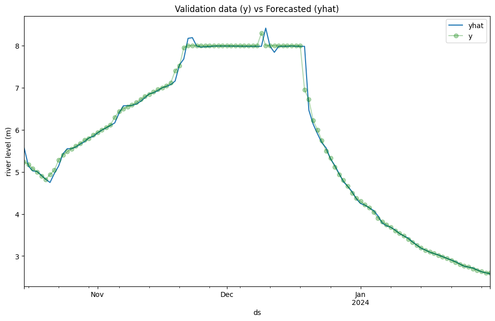
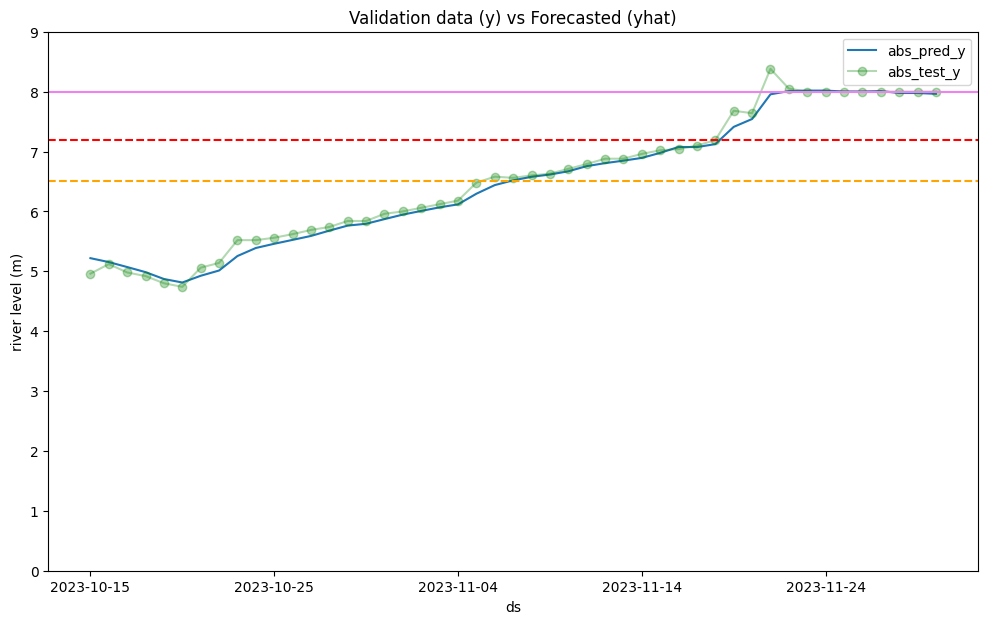

## Setup

First, create and activate a virtual environment:

```bash
python -m venv venv
source venv/bin/activate  # On Windows use `venv\Scripts\activate`
```

Next, install the package using `setup.py`:

```bash
pip install .
```

This will install all the necessary dependencies for the project.

## How-To Guide (CLI)

### Preprocess Data

```bash
python -m shaqodoon_forecasting preprocess bulo_burti -o "data/interim/test.csv" -s "./settings.conf"
```

This command preprocesses the data for the `bulo_burti` station and outputs the result to `data/interim/test.csv`.

### Split Data

```bash
python -m shaqodoon_forecasting split "data/interim/test.csv" -d "2024-10-01" -t "data/interim/test.train.csv" -e "data/interim/test.eval.csv" -s "./settings.conf"
# {
#     "train_df": [
#         "2021-11-24",
#         "2024-09-30"
#     ],
#     "test_df": [
#         "2024-10-15",
#         "2024-11-18"
#     ]
# }
```

This command splits the preprocessed data into training and evaluation datasets based on the specified date.

### List Model Types supported

```bash
python -m shaqodoon_forecasting list-models
# Supported model types:
#  - prophet_001
```

This commands list all model types supported by this tool.

### Train Model

```bash
python -m shaqodoon_forecasting train "data/interim/test.train.csv" -m "prophet_001" -o "models/test.model" -s "./settings.conf"
# 00:15:54 - cmdstanpy - INFO - Chain [1] start processing
# 00:15:55 - cmdstanpy - INFO - Chain [1] done processing
```

This command trains a model using the training dataset and saves the model to `models/test.model`.

### Evaluate Model

**WARNING**: Not yet supported, please refer to the experiment notebooks for now.

### Generate Inference Template

```bash
python -m shaqodoon_forecasting gen-infer-template bulo_burti -o "data/inference/test.csv" -s "./settings.conf"
```
This command generates an inference template for the `bulo_burti` dataset and outputs it to `data/inference/test.csv`.

### Run Inference

```bash
python -m shaqodoon_forecasting infer "models/test.model" "prophet_001" "./data/inference/test.csv"
# 3.6684506000000003
```

This command runs inference using the trained model and the inference template, outputting the result.
Update the input CSV file with the appropriate values to execute a forecast.


## Report

### UPDATE: post hackathon debrief

It turns out that the `Prophet` models were too good to be true.

While the RMSE is low, the model is not really able to anticipate changes in the trend.
It just follows well the curves once a change of trend has been detected.



This is not surprising since it bases its decision mostly (or only) on the river level.

We have defined a new *Baseline*: forecasting the level of the previous day
```python
f"RMSE BASELINE: {((test_df.lag1_level__m - test_df.level__m) ** 2).mean() ** .5:.4} meters"
# 'RMSE BASELINE: 0.1146 meters'
```

A new model, using scikit-learn and a `RandomForestRegressor` is able to anticipate changes of trend.

Notice in the image below how the model is able to forecast an increase of the river level the same day as it happens.



See `scikit-learn-experiment-000-forecast_1day_bulo_burti.ipynb` for more details.

'RMSE: 0.09859 meters'
